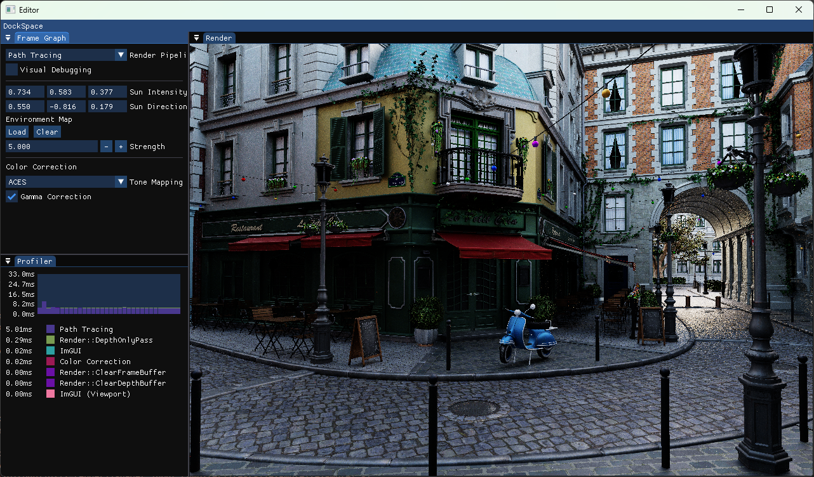
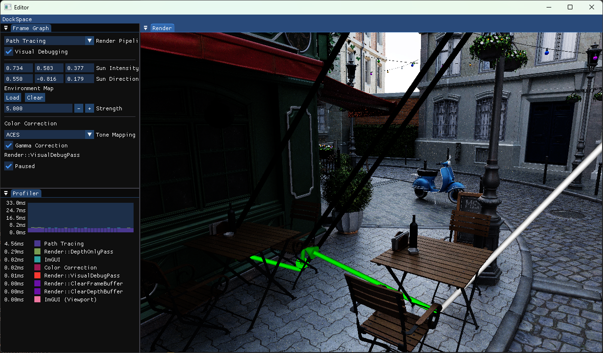
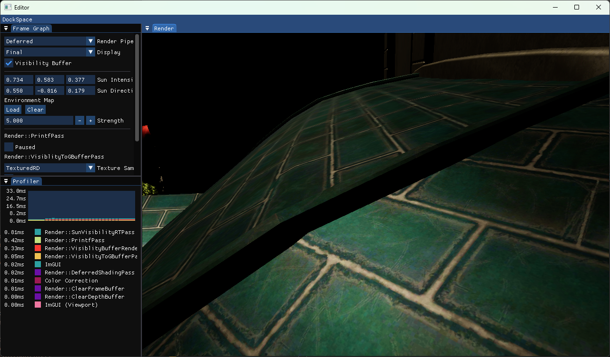
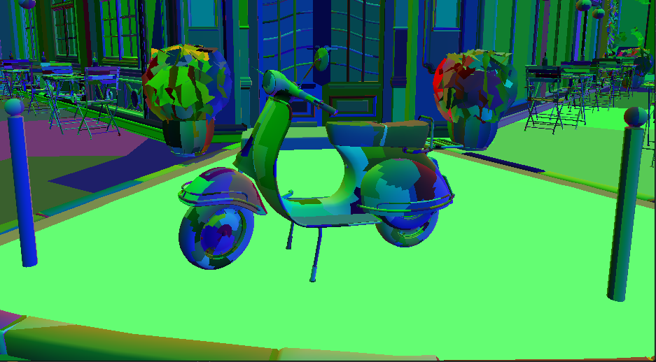
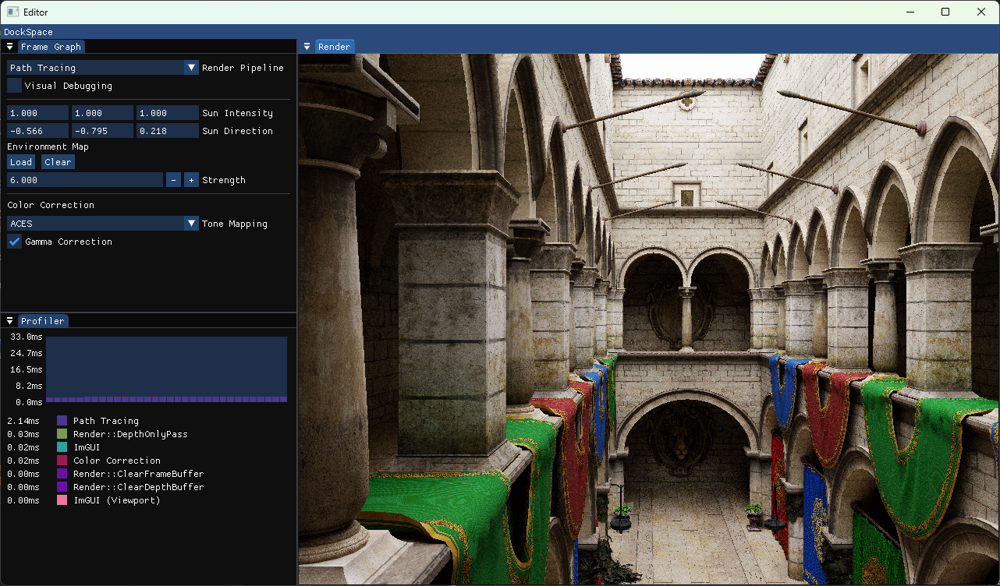

# DX12Render
DX12Render is a hobby project which provides a DirectX12 framework for experimenting with real-time rendering.



The code is split into the following parts:

| Folder | Description |
| --- | ---|
| editor | main executable |
| engine | contains all the engine/rendering code |
| gltf_optimizer | convert a `*.gltf/*.glb` file into a custom `*.bin` file to accelerate file loading |
| shader_input_compiler | C++/HLSL code generator to simplify shader resource binding ([README](shader_input_compiler/README.md)) |
| toolbox | library containing helper functions copied from another codebase |

## Features (WIP)
As-of writing, the rendering **engine** supports the following features:
 * Easy resource binding through C++/HLSL code generation (see [shader_input_compiler/README.md](shader_input_compiler/README.md))
 * Frame graph that takes care of resource transitions and memory aliasing of transient resources
 * Hot-reloading of shader code (changing HLSL files while the editor is running will automatically reload them)
 * Custom solution for `printf` within HLSL shaders
 * Helpers classes for building `ID3D12StateObject` and ShaderBindingTables (DirectX Ray Tracing).
 * ImGui based user interface with a frame profiler
 * Loading `gltf` and `glb` files`
 * Loading (HDR) textures

At the time of writing, the following rendering algorithms are implemented:
 * Path tracing
 * Forward & deferred rendering
 * Visibility buffer rendering with texture filtering
 * Mesh shading
 * Debug visualization of light paths using `ExecuteIndirect`

## Building
The code depends on various third party dependencies for JSON parsing, logging, memory allocation, etc.
These dependencies can be automatically installed using the [vcpkg package manager](https://github.com/microsoft/vcpkg).

If you have not yet installed `vcpkg`, you can do so as follows:
```bash
git clone https://github.com/microsoft/vcpkg.git
cd vcpkg
.\bootstrap-vcpkg.bat
.\vcpkg.exe integrate install
```

The code is build using `CMake`.
Use the "Open a local folder" option in the Visual Studio 2022 start-up screen to open the root folder of this project.
Visual Studio will automatically recognize that this is a `CMake` project and start configuring.
During this process, it will automatically invoke `vcpkg` (if installed correctly) to download the required dependencies.

## Running
Compile and run the `Editor.exe` executable:
```bash
Editor.exe file_to_load.glb [--docking]
```

The program supports loading `*.gltf`, `*.glb` and `*.bin` files (generated using the `gltf_optimizer` executable).
We recommend using a tool like Blender to convert 3D models into the `*.glb` format.

The `--docking` flag enables docking support in [imgui](https://github.com/ocornut/imgui/).

**Movement:** Use `W/A/S/D` to move around the scene. `ctrl/space` to move the camera up and down. Press `L` to toggle the camera lock (look with mouse).
**Visual Debug:** Press `P` to pause the visual debugging path.

## Screenshots
### Light path visualization
Path tracing consists of constructing many different light "paths". As a debugging feature, we can draw the path at the current mouse cursor position. Visual debugging is implemented entirely on the GPU using `ExecuteIndirect`.



### Manual MipMapping
When viewing distant textures, or textures at an angle, one pixel will cover a large area in the texture domain. This results in significant aliasing artifacts when implemented naively. The common solution for this issue is mipmapping which *typically* happens automatically. However, with visibility buffer rendering this feature is not automatically available and requires the manual derivation of the screen space derivatives. See the comments in the implementation for more detail (`engine/shaders/Engine/Rasterization/visibility_to_gbuffer_ps.hlsl`).



### Mesh Shader Rendering
Mesh shaders are a (relatively) new concept that aim to replace the legacy vertex processing pipeline (input assembler, vertex-, geometry-, tesselation- shaders). When loading a mesh, it is automatically partitioned into "meshlets" (small patches with a limited number of vertices/faces). The shader subsequently load the meshlets and transform the vertices; effectively replacing the input assembler and vertex shaders. The implementation supports both one draw call per mesh, or a single draw call for the entire scene (bindless).



### Obligatory Sponza screenshot
No rendering project is complete without a screenshot of Sponza...


